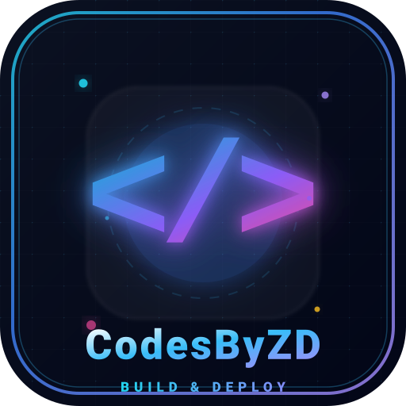

  

<h1 align="center">CodesByZD 🚀</h1>

  <strong>Build & Deploy</strong> — আপনার ডেভেলপমেন্ট টুলকিট ও প্রজেক্ট হাব

  
  
  
  

---

## 🌟 ভূমিকা (Introduction)

**CodesByZD** হলো একটি **Progressive Web App (PWA)** যা ডেভেলপারদের জন্য তৈরি করা হয়েছে। এখানে আপনি আপনার সব কোড, প্রজেক্ট ও টুলস এক জায়গায় সংগঠিত করতে পারবেন। FontMasterX-এর আদলে তৈরি এই প্রজেক্টটি Vercel-এ ডিপ্লয়ের জন্য সম্পূর্ণ অপটিমাইজড।

> "Build fast, deploy faster." — CodesByZD

---

## ✨ ফিচারসমূহ (Features)

- ⚡ **লাইটস্পিড পারফরম্যান্স** — Vercel এর এজ নেটওয়ার্কে হোস্টেড
- 📱 **মোবাইল-ফ্রেন্ডলি** — যেকোনো ডিভাইসে সুন্দর দেখায়
- 🌙 **ডার্ক থিম** — চোখের আরামদায়ক নিয়ন ডিজাইন
- 🔧 **PWA রেডি** — অ্যাপের মতো ইনস্টল করে ব্যবহার করুন
- 🎨 **কাস্টম লোগো** — সাইবার-নিয়ন স্টাইলের `</>` আইকন
- 🚀 **Vercel রেডি** — জিরো কনফিগারেশনে ডিপ্লয়

---

## 🛠️ টেকনোলজি স্ট্যাক (Built With)

- **HTML5** — স্ট্রাকচার
- **CSS3** — আধুনিক ডার্ক থিম ও অ্যানিমেশন
- **Vanilla JavaScript** — হালকা ইন্টারঅ্যাকশন
- **PWA (Manifest.json)** — অফলাইন সাপোর্ট ও হোমস্ক্রিন ইনস্টল
- **Vercel** — হোস্টিং ও ডিপ্লয়মেন্ট

---

## 🚀 লাইভ ডেমো (Live Demo)

> 🔗 **ভিজিট করুন:** [আপনার-ভার্সেল-লিংক.vercel.app](https://your-vercel-link.vercel.app)

*(ডিপ্লয়ের পর এখানে আপনার আসল লিংকটি বসিয়ে দিন)*

---

## 📂 প্রজেক্ট স্ট্রাকচার (Project Structure)

